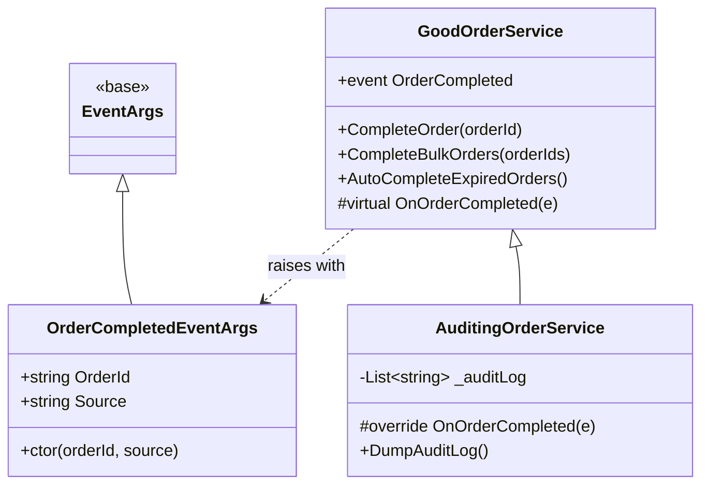
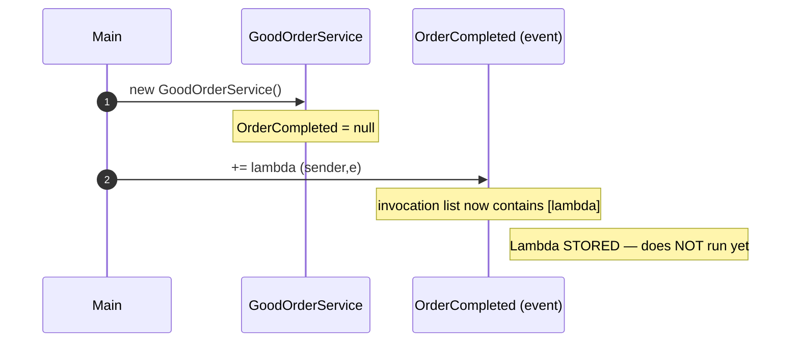
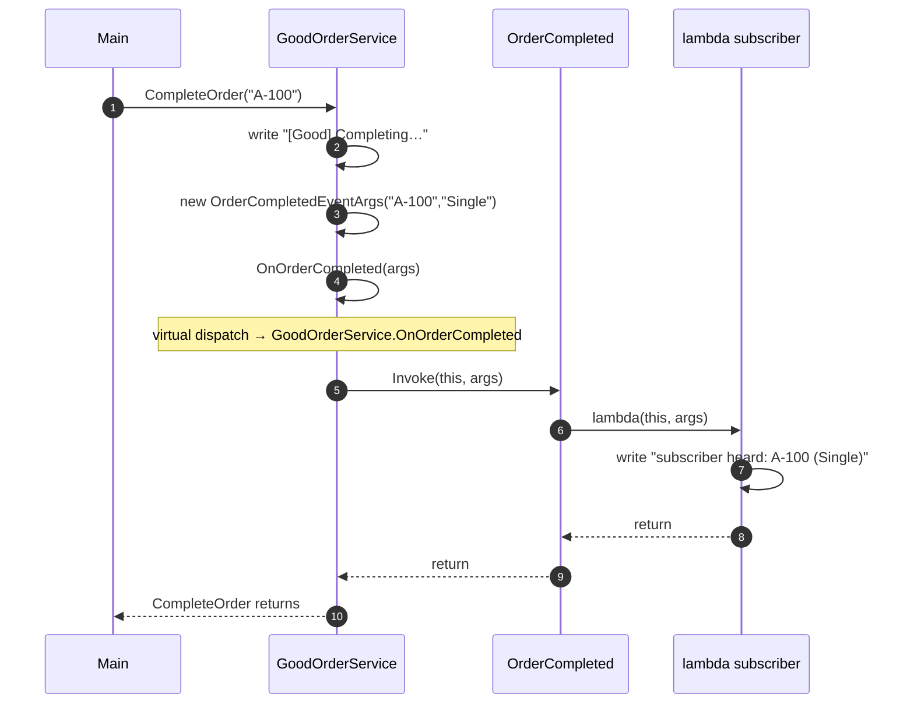
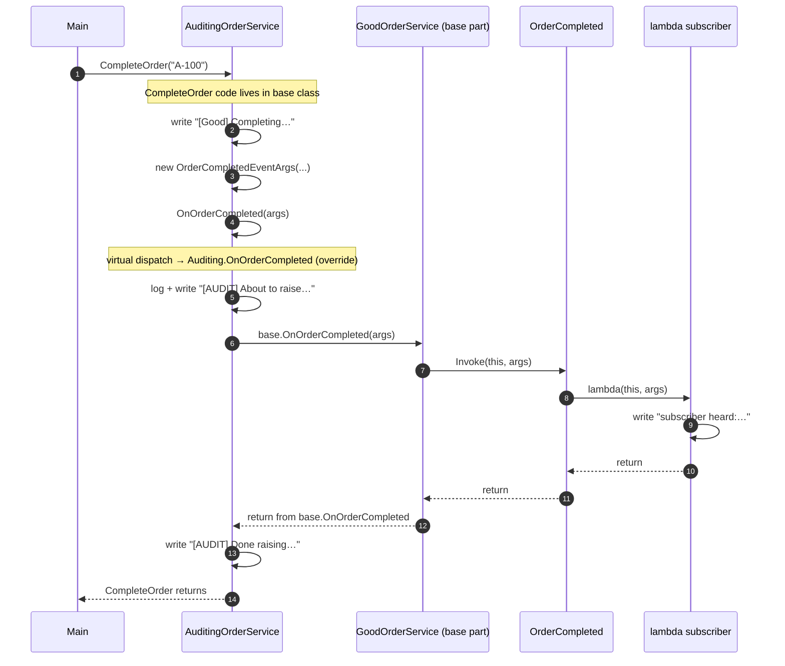
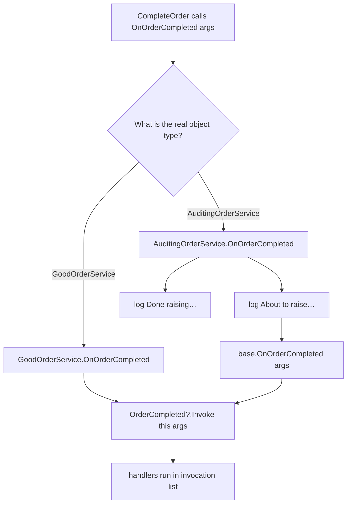

# Event Flow Reference — Good-Design.cs

Complete runtime trace of [Good-Design/Program.cs](./Good-Design/Program.cs).

Two views are provided:
- **ASCII art** — quick scanning, no extension needed
- **Mermaid** — rendered visually in VS Code (preview the markdown with `Ctrl+Shift+V`)

---

## 1. Static Class Structure

### 1a. ASCII view

```text
         OrderCompletedEventArgs            ◄─── inherits from ─── EventArgs
         (sealed, immutable payload)
         { OrderId, Source }

         ┌──────────────────────────────────────────┐
         │  GoodOrderService                        │
         │  ────────────────                        │
         │  + event OrderCompleted                  │
         │                                          │
         │  + CompleteOrder(orderId)                │ ──┐
         │  + CompleteBulkOrders(orderIds)          │ ──┼─► OnOrderCompleted(...)
         │  + AutoCompleteExpiredOrders()           │ ──┘
         │                                          │
         │  # protected virtual OnOrderCompleted(e) │ ──► OrderCompleted?.Invoke(this, e)
         └──────────────────────────────────────────┘
                          ▲
                          │  inherits
                          │
         ┌──────────────────────────────────────────┐
         │  AuditingOrderService : GoodOrderService │
         │  ──────────────────────────────────────  │
         │  - List<string> _auditLog                │
         │                                          │
         │  # override OnOrderCompleted(e)          │
         │      ├── log "About to raise..."         │
         │      ├── base.OnOrderCompleted(e)        │
         │      └── log "Done raising..."           │
         │                                          │
         │  + DumpAuditLog()                        │
         └──────────────────────────────────────────┘
```

### 1b. Mermaid class diagram



---

## 2. Phase 1 — Wiring (Registration)

What happens when `service.OrderCompleted += handler` runs. **The handler is stored, not executed.**

### 2a. ASCII view

```text
Step 1: new GoodOrderService()
  ┌──────────────────────────────────────────────┐
  │ GoodOrderService instance                    │
  │ ──────────────────────────                   │
  │ OrderCompleted = null   ← invocation list empty
  └──────────────────────────────────────────────┘

Step 2: service.OrderCompleted += lambda
  ┌──────────────────────────────────────────────┐
  │ GoodOrderService instance                    │
  │ ──────────────────────────                   │
  │ OrderCompleted ──► delegate object           │
  │                    invocation list:          │
  │                    [0] ── lambda             │
  └──────────────────────────────────────────────┘

  ★ Lambda is STORED. It does NOT run yet. ★
```

### 2b. Mermaid sequence diagram



---

## 3. Phase 2A — Execution: Base GoodOrderService

Call: `service.CompleteOrder("A-100")` where `service` is a plain `GoodOrderService`.

### 3a. ASCII view

```text
Main()
  │
  └── RunGoodDesign()
        │
        └── service.CompleteOrder("A-100")
              │
              ├── ① Console.WriteLine("[Good] Completing single order A-100")
              │
              ├── ② new OrderCompletedEventArgs("A-100", "Single")
              │
              └── ③ OnOrderCompleted(args)
                    │
                    └── ★ VIRTUAL DISPATCH check ★
                        Real object type = GoodOrderService
                        → use GoodOrderService.OnOrderCompleted
                          │
                          └── OrderCompleted?.Invoke(this, args)
                                │
                                ├── check: invocation list null? NO
                                │
                                └── for each handler in list:
                                      └── lambda(this, args)
                                            └── Console.WriteLine(
                                                "   subscriber heard: A-100 (Single)")
```

### 3b. Mermaid sequence diagram



---

## 4. Phase 2B — Execution: AuditingOrderService (Subclass)

Same call, but `service` is now an `AuditingOrderService`. **The virtual dispatch picks the override.**

### 4a. ASCII view

```text
Main()
  │
  └── RunSubclassDesign()
        │
        └── service.CompleteOrder("A-100")            ← inherited code, unchanged
              │
              ├── ① write "[Good] Completing single order A-100"
              ├── ② new OrderCompletedEventArgs("A-100","Single")
              │
              └── ③ OnOrderCompleted(args)
                    │
                    └── ★ VIRTUAL DISPATCH ★
                        Real object type = AuditingOrderService
                        → use AuditingOrderService.OnOrderCompleted   ◄── THE DIFFERENCE
                          │
                          ├── A. _auditLog.Add("[AUDIT] About to raise…")
                          ├── B. write "[AUDIT] About to raise…"
                          │
                          ├── C. base.OnOrderCompleted(args)
                          │       │
                          │       └── GoodOrderService.OnOrderCompleted
                          │             └── OrderCompleted?.Invoke(this, args)
                          │                   └── lambda(this, args)
                          │                         └── write "subscriber heard:…"
                          │
                          └── D. write "[AUDIT] Done raising…"
```

### 4b. Mermaid sequence diagram



---

## 5. The Virtual Dispatch Decision

This is the **mechanism** that makes the design powerful.

```text
At the line:    OnOrderCompleted(args);    inside CompleteOrder

The runtime looks at the REAL OBJECT TYPE, not the variable type:

┌────────────────────────────────────────┬────────────────────────────┐
│  Real object type                      │  Method that runs          │
├────────────────────────────────────────┼────────────────────────────┤
│  GoodOrderService                      │  Good.OnOrderCompleted     │
│  AuditingOrderService                  │  Auditing.OnOrderCompleted │
└────────────────────────────────────────┴────────────────────────────┘
```



---

## 6. Compact Rules to Memorize

```text
Rule 1: 业务方法只调用 OnXxx，不直接 Invoke。
        Business methods call OnXxx, never Invoke directly.

Rule 2: OnXxx 是唯一的 Invoke 入口（funnel point）。
        OnXxx is the single Invoke entry point.

Rule 3: 子类只 override 一个方法，影响所有业务方法。
        A subclass overrides ONE method, affects ALL business methods.

Rule 4: variable type 决定能调用哪些成员；
        real object type 决定 override 的哪个方法真正执行。
        Variable type = what's callable.
        Real object type = which override actually runs.

Rule 5: 默认事件是同步的，handler 跑在 publisher 的线程上。
        Events are synchronous by default; handlers run on the publisher's thread.
```

---

## 7. Side-by-Side Output Trace

```text
═══════════════════════════════════════════════════════════════════════════
  GoodOrderService                  AuditingOrderService
═══════════════════════════════════════════════════════════════════════════
  CompleteOrder("A-100")            CompleteOrder("A-100")
  │                                 │
  ├ "[Good] Completing…"             ├ "[Good] Completing…"
  ├ new args                         ├ new args
  └ OnOrderCompleted(args)           └ OnOrderCompleted(args)  ← override picked
       │                                  │
       │                                  ├ "[AUDIT] About to raise…"
       │                                  │
       └ Invoke ─► handler                └ base.OnOrderCompleted(args)
            └ "subscriber heard…"               │
                                                └ Invoke ─► handler
                                                     └ "subscriber heard…"
                                                                │
                                                          ┌─────┘
                                                ┌─────────┘
                                                │
                                                └ "[AUDIT] Done raising…"
═══════════════════════════════════════════════════════════════════════════
```

---

## Files in this folder

- [Good-Design/Program.cs](./Good-Design/Program.cs)
- [Bad-Design/Program.cs](./Bad-Design/Program.cs)
- [Your-Design/Program.cs](./Your-Design/Program.cs)
- [Practice-Exercise/](./Practice-Exercise/) — hands-on exercise (write from scratch)
